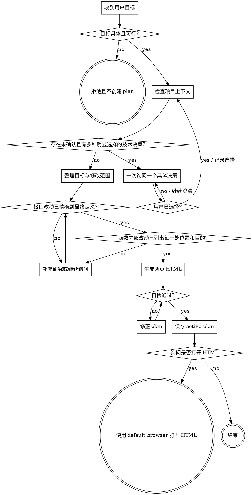

# Mini Plan

## 目标

把一个明确、可行的代码任务整理为一个可直接打开的两页 HTML plan。此 skill 只研究和写 plan，不 implement 代码。

## 接口改动

以下内容属于**接口改动**：

- 类型的新增、删除、重命名或结构变动。
- 数据定义的新增、删除、重命名、字段变动、约束变动。
- 函数、方法或可调用 API 的名称、参数、参数类型、默认值、返回类型、错误契约等接口变动。

以下内容**不属于接口改动**：

- 函数或方法内部的实现。
- `namespace` 调整。
- header include、import、using 等模块可见性调整。

`namespace`、header include、import、using 等内容不写入 plan。

## Hard gates

1. 用户没有给出具体代码目标时，拒绝执行，不创建 plan。
2. 目标明确不可行时，说明原因并拒绝执行，不创建 plan。
3. 未完成必要的技术决策确认前，不创建最终 plan。
4. 不 implement 代码。
5. plan 中不出现 compile、build、test、验证命令或相关步骤。只有当目标本身是新增、删除或修改 test 内容时，才把对应 test 文件当普通改动文件描述；仍不写运行 test 的步骤。

## 状态流程



终态只能是“拒绝且不创建 plan”“使用 default browser 打开 HTML”或“结束”。

## 执行方法

### 1. 判断目标

目标必须至少说明期望改变的行为或需要修复的问题，并且属于当前代码库可执行的代码任务。把明显独立的多个目标拆开；一个 plan 只覆盖一个连贯目标。

以下情况直接拒绝：

- 只有“优化一下”“看看代码”等没有成功条件的描述。
- 依赖不存在且无法获得的系统、数据或权限。
- 需求内部冲突，且用户不愿选择解决方式。
- 在当前代码库和约束内明确无法实现。

### 2. 检查上下文

在提问和写 plan 前，读取当前代码库的结构、相关实现、调用关系和已有约定。只研究目标相关范围，不做无关重构。

### 3. 确认技术决策

当一个未说明的决策同时满足以下条件时，必须询问用户：

- 存在至少两种明显可行的方案。
- 方案会改变接口、数据定义、架构边界、兼容性或用户可见行为。

每次只问一个决策。给出具体选项及关键 trade-off，让用户选择；不要把自己的偏好当成用户决定。如果用户的回答引出下一个独立决策，再单独询问。

不需要询问纯实现细节：已有代码约定已唯一决定的写法、局部变量名、等价的内部控制流等。

### 4. 锁定修改范围

先列出全部 create、modify、delete 文件，再写内容：

- **接口改动**：给出最终名称、完整类型、字段、参数顺序、默认值、返回值和错误契约。它必须能与未来 implementation 逐字或语义等价对照，不能使用“类似”“大概”“按需”等模糊词。
- **函数内部实现**：列出每一处修改位置。位置至少包含文件路径和 symbol；需要改同一 symbol 的多个分支时，分别写明分支/代码段及目的。
- **新增文件**：说明职责、包含的接口和被谁使用。
- **删除文件**：说明删除对象及相关调用如何处理。
- **架构图**：画出当前修改范围内的模块、依赖方向和数据流；明确标记要修改的模块以及接口/定义。
- 忽略 `namespace`、header include、import、using 等模块可见性细节。

如果发现需要超过两个逻辑页面才能清楚表达，说明目标范围过大并先请用户拆分，不生成缩水或不完整的 plan。

### 5. 生成 HTML

确保项目根目录存在：

```text
minipowers/
  done/
  archive/
```

读取同目录的 `plan-template.html`，保持其 metadata、两页结构、`data-*` 属性和 print 样式。替换全部示例内容，不得留下占位符或第三个逻辑页面。

文件名必须是：

```text
minipowers/plan_YYYYMMDD_HHMM_some_meaningful_plan_title.html
```

- 时间使用用户当前本地时间。
- title 使用有意义的英文小写 `snake_case`，不能使用 `untitled`、`misc`、`update` 等空泛名称。
- 新 plan 的 `minipowers-plan-status` 必须是 `active`。
- HTML 必须完全 standalone，可直接打开；不得依赖 CDN、外部 CSS、外部 JavaScript 或网络字体。
- 架构图使用 inline SVG 或纯 HTML/CSS，不使用外部渲染器。

## 两页内容合同

### 第一页：Overview

严格按以下顺序：

1. plan 标题、生成时间和目标摘要。
2. 简洁目标列表；允许两级子目标，不允许第三级。
3. 当前修改范围的架构图，标记：
   - `[修改]` 模块。
   - `[新增]` / `[删除]` 模块。
   - `[接口]` 类型、数据定义、函数接口。
4. 接口改动表。没有接口改动时明确写“无接口改动”，不能省略该区块。

### 第二页：改动清单

每个改动项必须有稳定 ID，并包含：

- 操作：create、modify 或 delete。
- 精确文件路径。
- 精确位置：symbol、类型、字段或文件区段。
- 改动内容和目的。
- 接口改动的完整最终定义；没有则写“无”。
- 函数内部实现的每一处位置和目的；没有则写“无”。

清单顺序就是 `mini-work` 的默认执行顺序。

## 自检

保存前逐项检查：

- 文件名、时间和 title 格式正确。
- 只有两个逻辑页面，Overview 在前、改动清单在后。
- 所有目标需求都有对应改动项。
- 所有改动文件都出现在架构图或改动清单中。
- 每个接口改动都有完整最终定义，而且跨改动项名称与类型一致。
- 每个函数内部改动都包含每一处位置和目的。
- 没有 `namespace`、header include、import、using 细节。
- 没有 compile、build、test 或验证步骤；目标本身修改 test 时，只描述 test 文件内容。
- 没有 TBD、TODO、placeholder、待定、按需、类似处理等模糊内容。
- HTML 无外部依赖，可以直接打开。

任何一项不通过都先修正，再保存。

## 完成回复

1. 报告 plan 已生成及其路径。
2. 询问用户是否需要现在打开 HTML，只提供 yes / no 两个动作。
3. 用户选择 yes 时，使用操作系统的 default browser 打开生成的 HTML，然后结束。
4. 用户选择 no 时，直接结束。

不要开始 implement，也不要自动调用 `mini-work`。
