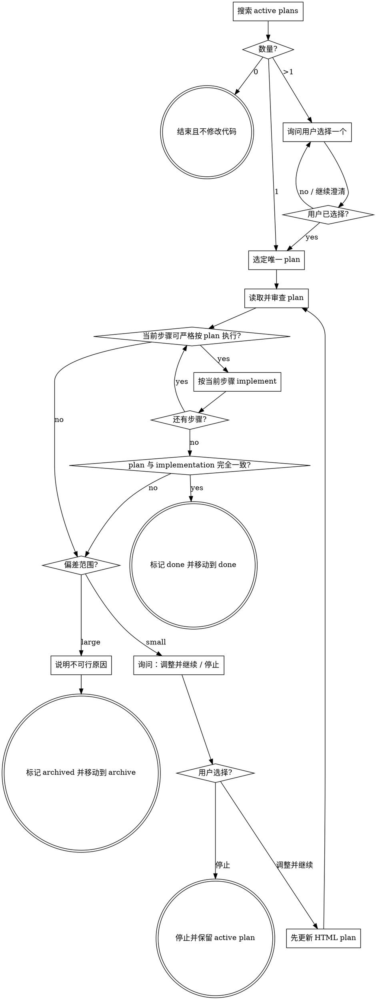

# Mini Work

## 目标

从当前项目的 `minipowers/` 中严格选择并执行一个 active plan。不能合并、并行或顺带执行其他 plan。

## 接口改动

以下内容属于**接口改动**：

- 类型的新增、删除、重命名或结构变动。
- 数据定义的新增、删除、重命名、字段变动、约束变动。
- 函数、方法或可调用 API 的名称、参数、参数类型、默认值、返回类型、错误契约等接口变动。

以下内容**不属于接口改动**：

- 函数或方法内部的实现。
- `namespace` 调整。
- header include、import、using 等模块可见性调整。

必要的 `namespace`、header include、import、using 调整不要求写入 plan，也不单独构成 plan 偏差；它们只能发生在 plan 已列出的文件中。若因此必须修改一个未计划文件，按大范围偏差处理。

## 不可违反的规则

1. 一次 invocation 必须严格执行零个或一个 plan，绝不能执行两个。
2. 没有 active plan 时立即结束，不修改代码。
3. 多个 active plan 时必须让用户选择，不能自行挑选。
4. 选定后严格按 plan 的改动清单和接口最终定义 implement。
5. 发现偏差时先停止，不能先改代码再补 plan。
6. 未经用户明确同意，不能调整小范围偏差。
7. 大范围偏差不能在本次执行中调整 plan 或继续 implement。
8. 不增加 plan 中没有的 compile、build、test 或验证步骤。plan 本身修改 test 文件时，只 implement 该文件中列出的内容。

## active plan 的定义

只搜索项目根目录下：

```text
minipowers/plan_*.html
```

必须同时满足：

- 是 `minipowers/` 的直属文件。
- `<meta name="minipowers-plan-status" content="active">`。
- 包含 `data-page="overview"` 和 `data-page="changes"`。

`minipowers/done/`、`minipowers/archive/` 及其他子目录中的文件永远不参与选择。

## 状态流程



终态只能是：

- 没有 plan 时“结束且不修改代码”。
- 用户停止时“停止并保留 active plan”。
- 大范围偏差时“标记 archived 并移动到 archive”。
- 完成时“标记 done 并移动到 done”。

## 执行方法

### 1. 搜索并选择

确保 `minipowers/done/` 和 `minipowers/archive/` 存在，然后只枚举 active plan：

- **0 个**：告诉用户没有可执行 plan，立即结束。
- **1 个**：直接选定。
- **多个**：列出文件名和每个 plan 的目标摘要，一次询问用户选择一个。用户没有明确选择前不修改代码。

选择后冻结本次 scope。后续即使目录中出现新 plan，也不切换、不合并。

### 2. 审查唯一 plan

读取 Overview、架构图、接口改动表和全部改动项。开始前确认：

- HTML 是有效的 active MiniPowers plan。
- create、modify、delete 的文件和顺序明确。
- 每个接口改动都有完整最终定义。
- 每个函数内部改动都有精确位置和目的。
- plan 不要求同时执行另一个 plan。

审查的目的不是自由改写 plan，而是避免执行一个本身不可行的 plan。发现问题时按后文的 small / large 偏差分类，不猜测。

### 3. 严格 implement

按 `data-change-id` 顺序逐项执行：

- 只 create、modify、delete 清单列出的文件。
- 接口名称、类型、字段、参数顺序、默认值、返回值和错误契约与 plan 完全一致。
- 函数内部只改列出的位置，并实现对应目的。
- 不做无关 refactor、cleanup 或“顺手优化”。
- `namespace`、header include、import、using 可在已计划文件内按实现需要调整，不写回 plan。

每项开始前先判断它能否严格执行。不能时立即停止当前项并分类，禁止先做一个猜测版本。

### 4. 偏差分类

偏差只指执行时发现 plan 不可行而必须改变的内容；plan 已明确列出的新增文件、新类型或接口改动不是偏差。

#### Small 偏差

必须同时满足：

- 只涉及 plan 已列出的文件。
- 不新增文件，不新增类型，不改变架构边界。
- 只是少量接口细节或少量函数内部位置/逻辑需要调整。
- 调整后仍保持原目标、原模块职责和主要数据流。

典型情况：一个已计划函数的参数细节需要小改；一个已计划分支还需覆盖相邻分支；现有类型的一个已计划字段定义需要窄幅修正。

#### Large 偏差

满足任一项即为 large：

- 需要新增 plan 未列出的文件。
- 需要新增 plan 未列出的类型或数据定义。
- 需要大范围修改接口，或影响新的调用方集合。
- 需要改变架构边界、主要数据流或模块职责。
- 需要删除/替换 plan 未覆盖的子系统。
- small 调整不断扩张，已不能保持原修改范围。

不确定是 small 还是 large 时，按 large 处理，不能用拆成多个 small 的方式绕过。

### 5. Small 偏差处理

向用户说明：

- 哪一项无法按 plan 执行。
- 原 plan 内容与现实约束。
- 可选的精确小范围修改及影响。

只提供两个动作：

1. **调整 plan 并继续**。
2. **停止执行**。

如果存在多种技术方案，在“调整 plan 并继续”之前继续一次询问一个具体方案，直到用户明确选择。

用户选择调整并继续时：

1. 先修改原 HTML，不能先修改代码。
2. 同步更新目标、架构图、接口表、相关改动项，使 plan 再次与预期 implementation 完全一致。
3. 在第二页调整记录中追加时间、原因、用户选择和受影响 ID。
4. 保持原文件名和 `active` 状态。
5. 重新审查完整 plan 后继续。

用户选择停止时：立即停止，不移动文件，plan 保持在 `minipowers/` 且状态为 `active`。

### 6. Large 偏差处理

不能询问用户是否在本次执行中硬做，也不能把 large 偏差改写成新 plan 后继续。

1. 停止 implement，不执行所需的大范围改动。
2. 清楚说明原 plan 为什么不可行、需要哪些新的文件/类型/接口/架构改动。
3. 将 HTML 的 `minipowers-plan-status` 改为 `archived`。
4. 在调整记录中写入 archive 时间和原因。
5. 将文件移动到 `minipowers/archive/`。
6. 告诉用户需要重新使用 `mini-plan` 制定计划。

不要擅自 revert 用户原有改动。若本次执行在发现 large 偏差前已经完成部分计划内改动，明确列出这些文件和未完成状态；除非能精确识别且安全撤销仅由本次执行产生的改动，否则不做破坏性回滚。

### 7. 完成

全部改动项完成后，逐项对照：

- 文件集合和 create、modify、delete 操作一致。
- 所有接口最终定义与 implementation 完全一致。
- 所有函数内部位置和目的均已实现。
- 没有 plan 外的代码改动；允许已计划文件内必要的模块可见性调整。

只有完全一致时：

1. 将 `minipowers-plan-status` 改为 `done`。
2. 在调整记录中追加完成时间。
3. 将 HTML 移动到 `minipowers/done/`。
4. 向用户报告完成和新的 plan 路径。

如果不一致，回到偏差分类，不能宣称完成。

## 常见错误

| 错误 | 正确做法 |
|---|---|
| 多个 plan 时选择最新的 | 必须让用户选择 |
| 同时执行两个相关 plan | 一次严格执行一个 |
| 发现小问题后先改代码 | 先询问，再先更新 HTML |
| 为了完成而新增未计划文件 | large 偏差，archive |
| 接口“基本一致”就算完成 | 必须与最终定义完全一致 |
| 顺手运行 compile、build 或 test | 不增加 plan 外步骤 |
| 把停止的 plan 移到 archive | 用户仅选择停止时保留 active |
