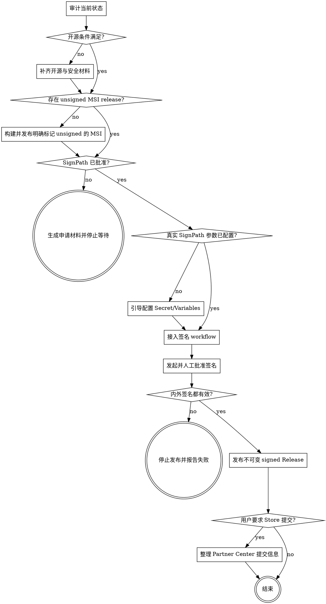

# Sign Publish

## 目标

把 DictatingMe 从公开源码构建为可追溯的 unsigned MSI，完成 SignPath
Foundation 申请；审核通过后，在 GitHub-hosted runner 上让 SignPath 同时签名
MSI 内部 PE 和 MSI 外层，验证签名后发布不可变 Release，并提交 Microsoft
Store。

本 skill 是可恢复的阶段流程。每次 invocation 先识别当前阶段，只执行当前可行
阶段，不伪造外部审批结果。

## 固定技术决策

- 项目许可证：Apache-2.0。
- 版权主体：`DexterDreeeam`。
- 免费签名服务：SignPath.io，证书主体为 SignPath Foundation。
- Microsoft Store 发行格式：MSI。
- Windows 架构：x64 (`x86_64-pc-windows-msvc`) 与 arm64
  (`aarch64-pc-windows-msvc`) 各自产生独立 MSI。
- 本地独立发行格式：现有 NSIS，`run_release.cmd` 保持可用。
- Store MSI 必须内置 WebView2 offline installer。
- Store 最终产物必须同时满足：
  - MSI 外层 Authenticode 有效。
  - MSI 内部 DictatingMe PE 文件 Authenticode 有效。
- SignPath 签名必须由 GitHub-hosted runner 产生的 artifact 发起。
- 每个签名请求必须由 signing approver 人工批准。

## Hard gates

1. 未获得 SignPath Foundation 审核通过，不得把任何文件描述为 SignPath signed。
2. 未获得真实 Organization ID、Project slug、Signing policy slug 和 Artifact
   configuration slug，不得编造值或提交不可运行的签名步骤。
3. `SIGNPATH_API_TOKEN` 只能保存为 GitHub Actions Secret；不得写入文件、日志、
   命令参数输出、issue、release notes 或对话回复。
4. 只签项目自己构建的代码。不得用 SignPath Foundation 证书重签第三方 PE。
5. 未验证 x64/arm64 两个 MSI 外层和安装后/解包后的项目 PE，不得发布 signed
   release。
6. 签名后不得修改、重打包或覆盖文件；任何字节变化都必须重新签名。
7. 已提交 Microsoft Store 的版本化 URL 不得替换文件。新版本必须使用新 URL。
8. 不使用 self-signed 证书冒充公开受信签名。
9. 不使用 Azure Artifact Signing 替代本 Store 流程；Microsoft 当前将其定位为
   non-Store distribution。
10. 不自动 push、打 tag、创建 Release 或提交 Partner Center，除非用户已明确
    要求对应远程操作。

## 状态流程



## 阶段 0：审计

先读取：

- `LICENSE`
- `NOTICE`
- `README.md`
- `PRIVACY.md`
- `SECURITY.md`
- `CONTRIBUTING.md`
- `CODE_SIGNING_POLICY.md`
- `RELEASING.md`
- `THIRD_PARTY_NOTICES.md`
- `Cargo.lock`
- `package-lock.json`
- `.github/CODEOWNERS`
- `.github/workflows/release-build.yml`
- `runtime/tauri.conf.json`
- `runtime/windows-app-manifest.xml`

然后检查：

1. 仓库是 public。
2. GitHub 已识别 Apache-2.0。
3. 项目没有商业双重许可和 proprietary component。
4. Rust/Node 依赖没有缺失许可证声明或已知高危漏洞。
5. GitHub 写权限和签名角色都启用 MFA。无法从 API 确认时，明确要求用户人工确认。
6. README 与 Release 页面都包含：

   ```text
   Free code signing provided by SignPath.io,
   certificate by SignPath Foundation.
   ```

7. 已有项目公开说明、隐私政策、卸载方法、安全报告渠道。
8. Release workflow 的所有前置 job 都使用 GitHub-hosted runner。
9. 第三方 GitHub Actions 固定到完整 commit SHA，不只使用可移动 tag。
10. 当前工作区是否有用户未提交改动；不得把无关改动混入发布提交。

任何一项不满足，先修复该项，不进入签名或发布。

## 阶段 1：准备 Store 专用 MSI

### 独立配置

创建 `runtime/tauri.microsoftstore.conf.json`，只覆盖 Store 需要的配置，不破坏
日常 NSIS：

```json
{
  "bundle": {
    "targets": ["msi"],
    "publisher": "<Partner Center 中确认的发布者名称>",
    "windows": {
      "webviewInstallMode": {
        "type": "offlineInstaller"
      }
    }
  }
}
```

`publisher` 是用户可见且与账号身份相关的决策，不能猜测。缺失时使用
`ask_user` 一次只确认这个值。

### 版本一致性

每次发布前确保下列版本完全一致：

- `package.json`
- `package-lock.json`
- `runtime/Cargo.toml`
- `runtime/tauri.conf.json`

旧 Release 的版本号和 URL 不得复用。

### Unsigned 构建

Store workflow 使用 matrix：

- x64：`windows-2025`，target `x86_64-pc-windows-msvc`。
- arm64：`windows-11-arm`，target `aarch64-pc-windows-msvc`。

两个 job 都必须是 GitHub-hosted runner，并执行：

1. checkout 精确 commit/tag。
2. 安装固定 Node/Rust 版本。
3. `npm ci`。
4. 获取 KWS bundled model并校验 catalog 中的文件 SHA。
5. 获取上游 sherpa-onnx v1.13.4 对应架构的静态库并验证 release SHA：
   - x64：`d81bd1d25112540862d2387072e76b2b6843ef962918d6b5c7db5a19c6276b4c`
   - arm64：`85504fcbe2e97b8369afe9e3ddc3c1695fe8839e9d683e42167b44174943dda1`
6. 使用 `assets/run-store-release.ps1` 和 Store config 构建 MSI。
7. 记录 MSI SHA-256。
8. 用 `actions/upload-artifact` 分别上传单一 x64/arm64 unsigned MSI。

上传 artifact 的 action 必须暴露 `artifact-id`，供 SignPath connector 验证来源。

## 阶段 2：第一个 unsigned Release

SignPath 要求项目已经以待签名形式发布。审核前必须先有一个同时包含 x64 与
arm64 的公开 unsigned MSI Release：

1. 从默认分支的版本 commit 打 `v*` tag。
2. 由 GitHub-hosted workflow 生成两个 MSI。
3. Release 名称和两个文件名都包含 `unsigned` 和架构。
4. Release notes 必须写：

   ```text
   This release is unsigned and has not been verified by SignPath Foundation.
   ```

5. Release notes 包含 source commit、SHA-256、源码归档、隐私政策、签名政策。
6. x64/arm64 均成功后才能发布该 unsigned Release。
7. 不把 unsigned MSI 提交 Microsoft Store。

## 阶段 3：申请 SignPath Foundation

在 `https://signpath.org/apply` 准备并提交：

- Project name：DictatingMe
- Repository：`https://github.com/DexterDreeeam/DictatingMe`
- OSI license：Apache-2.0
- Download：包含 x64/arm64 MSI 的第一个 unsigned Release
- Project description：Windows 本地听写工具，本地 ONNX 推理
- Code signing policy：仓库中的 `CODE_SIGNING_POLICY.md`
- Privacy policy：仓库中的 `PRIVACY.md`
- Maintainer / reviewer / approver：`DexterDreeeam`
- Build system：GitHub Actions，GitHub-hosted Windows runner
- Dependency provenance：lockfiles + `THIRD_PARTY_NOTICES.md`

申请后终态是“等待 SignPath 审核”。不得预先声称通过，也不得加入虚假项目 ID。
SignPath 对项目知名度和可验证 reputation 有人工判断，申请不保证通过。

## 阶段 4：审核通过后的 SignPath 配置

### SignPath 后台

1. 创建/确认 DictatingMe project。
2. 上传 x64 和 arm64 unsigned MSI 样本，确认同一 Artifact Configuration
   能完整匹配两者；不能匹配时创建两个明确的 architecture-specific 配置。
3. 选择 **Sign nested files**。
4. 审查自动生成配置：
   - 只给 DictatingMe 自有 PE 添加 `<authenticode-sign/>`。
   - 不重签 WebView2、系统组件或其他第三方 PE。
   - 先签 MSI 内部 PE，再重打包并签 MSI 外层。
   - 对 product name、version、company/copyright 增加 metadata restriction。
5. 创建 signing policy，要求 signing approver 人工批准。
6. 连接 GitHub repository / GitHub connector。
7. 记录真实：
   - Organization ID
   - Project slug
   - Signing policy slug
   - Artifact configuration slug

### GitHub 配置

只创建：

- Secret：`SIGNPATH_API_TOKEN`
- Variables：
  - `SIGNPATH_ORGANIZATION_ID`
  - `SIGNPATH_PROJECT_SLUG`
  - `SIGNPATH_SIGNING_POLICY_SLUG`
  - `SIGNPATH_ARTIFACT_CONFIGURATION_SLUG`

API token 不得放进 Variable。

## 阶段 5：接入签名 workflow

在 matrix 中每个 unsigned MSI 已上传后调用官方 action。接入时先查询官方
action 的当前稳定版本并固定到完整 commit SHA：

```yaml
- name: Submit SignPath signing request
  id: signpath
  uses: signpath/github-action-submit-signing-request@<pinned-commit-sha>
  with:
    api-token: ${{ secrets.SIGNPATH_API_TOKEN }}
    organization-id: ${{ vars.SIGNPATH_ORGANIZATION_ID }}
    project-slug: ${{ vars.SIGNPATH_PROJECT_SLUG }}
    signing-policy-slug: ${{ vars.SIGNPATH_SIGNING_POLICY_SLUG }}
    artifact-configuration-slug: ${{ vars.SIGNPATH_ARTIFACT_CONFIGURATION_SLUG }}
    github-artifact-id: ${{ steps.upload-unsigned-installer.outputs.artifact-id }}
    wait-for-completion: true
    output-artifact-directory: signed
```

是否使用 `skip-decompress` 由当时 `upload-artifact` 的 `archive` 设置和 SignPath
官方 action schema决定；必须查当前文档，不能凭记忆填写。

签名 workflow 必须：

- 仅在版本 tag 或显式 `workflow_dispatch` 上运行。
- 不在 fork PR 上获取 Secret。
- 限制 `GITHUB_TOKEN` 权限。
- 签名完成前不创建 public Release。
- SignPath 失败、拒绝或超时都使 workflow 失败。

## 阶段 6：验证签名

### 外层 MSI

对 x64 和 arm64 MSI 分别执行：

```powershell
Get-AuthenticodeSignature .\signed\DictatingMe*.msi |
  Format-List Status,StatusMessage,SignerCertificate,TimeStamperCertificate
```

并使用 Windows SDK：

```powershell
signtool verify /pa /all /v .\signed\DictatingMe*.msi
```

### 内层 PE

管理安装解包到临时目录：

```powershell
$msi = (Resolve-Path .\signed\DictatingMe*.msi).Path
$target = Join-Path $env:RUNNER_TEMP 'dictatingme-msi'
New-Item -ItemType Directory -Path $target -Force | Out-Null
$process = Start-Process msiexec.exe `
  -ArgumentList @('/a', "`"$msi`"", '/qn', "TARGETDIR=`"$target`"") `
  -Wait -PassThru
if ($process.ExitCode -ne 0) { throw "MSI extraction failed: $($process.ExitCode)" }
```

找到项目自有 `.exe` / `.dll` 后逐个执行：

```powershell
Get-AuthenticodeSignature <path>
signtool verify /pa /all /v <path>
```

通过条件：

- `Status == Valid`。
- 证书链有效。
- 有可信时间戳。
- Signer 符合 SignPath Foundation 批准的证书。
- 两个 MSI 外层及其中各自的 `dictatingme.exe` 都通过。
- signed MSI 安装后应用可启动，卸载可完成。

任何一项失败，删除/隔离该 signed artifact，不发布。

## 阶段 7：发布 signed GitHub Release

只有用户明确要求发布后才执行：

1. Release 对应唯一 tag 和 source commit。
2. 只上传最终 x64/arm64 signed MSI、各自 SHA-256 文件和源码归档。
3. 两个 MSI 文件名含版本与架构，不含 `unsigned`。
4. Release notes 包含：

   ```text
   Free code signing provided by SignPath.io,
   certificate by SignPath Foundation.
   ```

5. 包含签名政策、隐私政策、source commit、SHA-256。
6. 上传后重新下载公开 URL，验证 SHA-256 与签名。
7. 禁止删除后在相同 URL 重传不同字节。

## 阶段 8：Microsoft Store

Partner Center 创建 **EXE or MSI app**，选择 MSI，并添加两个 package：

| 字段 | 值 |
| --- | --- |
| App type | MSI |
| Architecture | x64 package 选 x64；arm64 package 选 arm64 |
| Language | zh-CN |
| Package URL | 版本化、公开 HTTPS signed MSI URL |
| Silent install | MSI 由 Store 使用 `/qn` |
| Privacy policy | `PRIVACY.md` 的公开 URL |
| License terms | Apache-2.0 / Store listing terms |

提交前检查：

- URL 无需登录即可下载。
- URL 内容不可变。
- MSI 是 standalone/offline installer。
- WebView2 offline installer 已包含。
- listing 至少有 1 张截图，推荐 4 张以上。
- 声明 microphone 系统要求。
- certification notes 说明：
  - 本地语音识别与本地历史。
  - 用户主动下载可选模型。
  - 应用当前使用管理员权限和 UAC。
  - 测试首次启动、模型下载和听写的具体步骤。

Store 认证通过前不得称为 “available in Microsoft Store”。

## 完成判定

只有同时满足以下条件，才可报告“签名发布完成”：

1. SignPath Foundation 已批准。
2. 签名 workflow 使用真实参数并成功完成。
3. 人工批准记录存在。
4. x64/arm64 外层 MSI 和内层 DictatingMe PE 签名均有效。
5. 两个最终 SHA-256 均已记录。
6. signed Release 已发布两个架构，且公开下载复核一致。

Microsoft Store 发布是独立完成状态：必须在 Partner Center certification 通过并
实际可用后才能报告完成。
