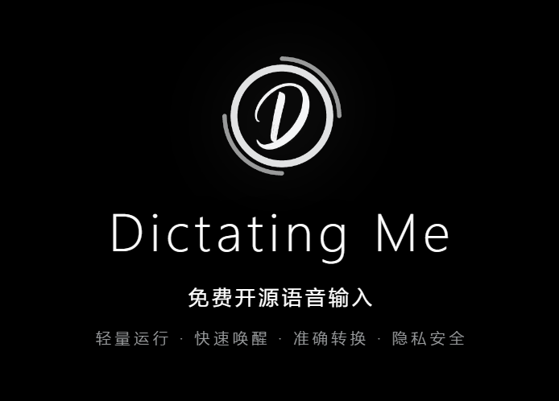
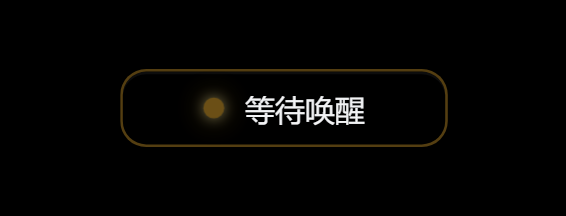
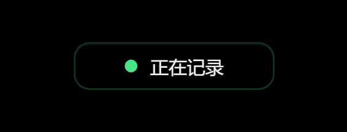
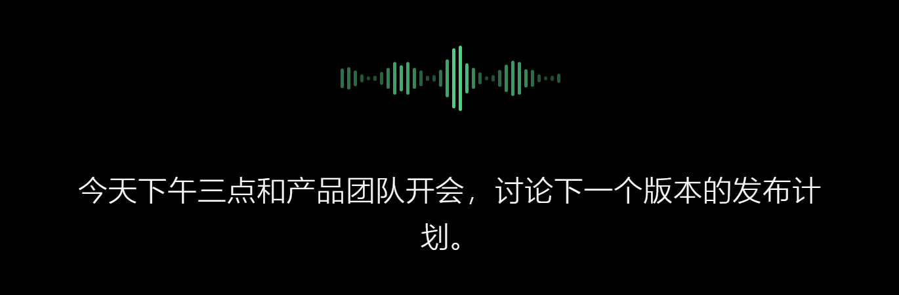
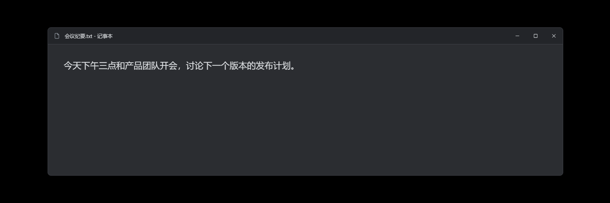
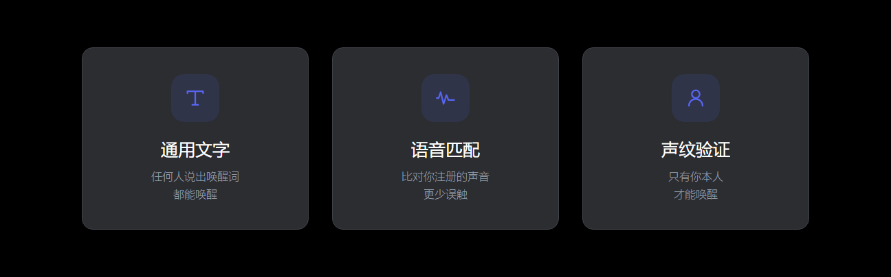

<p align="center">
  
</p>

<p align="center">
  <b>Windows 本地语音听写 · 唤醒词触发 · 文字直接落进当前窗口</b>
</p>

<p align="center">
  <a href="https://github.com/DexterDreeeam/DictatingMe/releases/latest"></a>
  <a href="https://github.com/DexterDreeeam/DictatingMe/actions/workflows/release-build.yml"></a>
  <a href="LICENSE"></a>
  
</p>

---

DictatingMe 是一个 Windows 本地听写工具：说出唤醒词进入听写状态，用本地 ONNX
模型识别语音，把文本直接输入到你正在用的窗口。

麦克风音频、听写历史和声纹 profile 默认只保存在本机，**不上传到任何服务器**。

## 怎么用

**1 · 常驻待命，说出唤醒词**

指示灯常驻在小窗里，等待时是黄色。



**2 · 唤醒后开始记录，说话即出字**

指示灯转绿，Zipformer 流式识别边说边出文字。





**3 · 文字直接落进当前窗口**

不用复制粘贴，识别结果直接注入你正在编辑的窗口。



## 三种唤醒方式



| 方式 | 谁能唤醒 | 适用场景 |
| --- | --- | --- |
| 通用文字 | 任何人说出唤醒词 | 自己独处，图省事 |
| 语音匹配 | 声音接近注册录音的人 | 多人环境，想少些误触 |
| 声纹验证 | 只有本人 | 共用设备，要求严格 |

唤醒词支持全自定义，不限于示例里的「小迪小迪」。

## 功能

- 通用文字、语音匹配和声纹验证三种唤醒方式。
- Zipformer 流式识别与 Qwen3-ASR 整句识别。
- 本地模型推理，不把麦克风音频或听写文本上传到 DictatingMe 服务。
- 最近 20 条听写历史及本地录音回放。
- 深浅主题窗口和托盘图标。

## 安装

到 [Releases](https://github.com/DexterDreeeam/DictatingMe/releases/latest)
下载最新的安装包运行即可。

### 系统要求

- Windows 10 或 Windows 11 x64。
- 麦克风。
- 首次使用听写或声纹功能时，需要按用户选择下载相应模型。
- 当前版本以管理员权限运行，以便向普通和管理员窗口注入文本。

## 从源码构建

需要 Node.js、Rust stable、Windows SDK 和 NSIS。

```powershell
npm ci
.\assets\download-assets.ps1
.\assets\run-release.ps1
```

生成的安装包位于 `release\`。构建使用 `Cargo.lock` 和
`package-lock.json` 固定依赖版本。

发布用的 x64/arm64 MSI 使用：

```powershell
.\run_store_release.cmd all
```

对应产物位于 `release\store\x64` 和 `release\store\arm64`。

## 隐私与安全

- [隐私政策](PRIVACY.md)
- [安全政策](SECURITY.md)
- [第三方许可与模型来源](THIRD_PARTY_NOTICES.md)
- [发布流程](RELEASING.md)

## 贡献

请阅读 [CONTRIBUTING.md](CONTRIBUTING.md)。所有提交到本仓库的贡献均按
Apache-2.0 许可提供。

## 许可证

Copyright 2026 DexterDreeeam.

本项目的代码、UI、图标和文档使用
[Apache License 2.0](LICENSE)，不使用商业双重许可。第三方组件和模型保留
各自许可证。